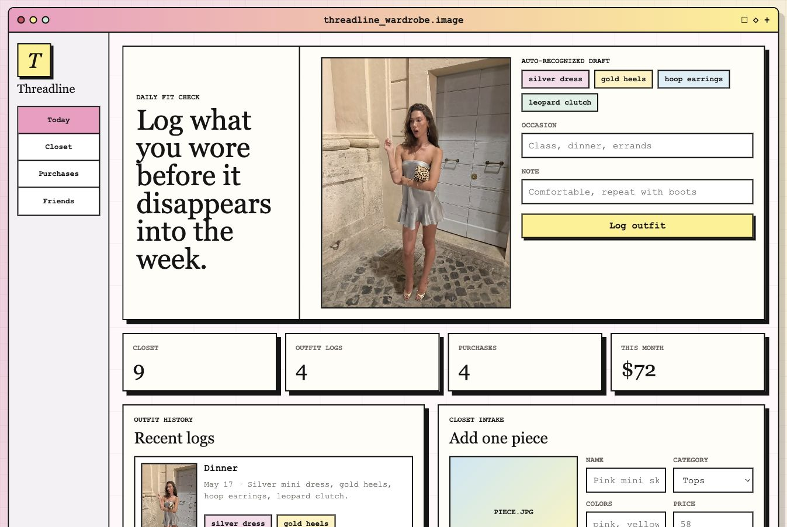

# Threadline

Threadline is a closet memory and purchase tracking prototype. The core loop is simple: log what you wore today, keep your closet organized, track purchases and wishlist items, and glance at friend activity for style context.



## Product Focus

The app is intentionally tighter than a general fashion dashboard. It focuses on four surfaces:

- Today: upload a daily outfit photo, review recognized tags, and save the outfit.
- Closet: keep owned pieces in one visual board.
- Outfits: review a history of saved looks.
- Suggestions: generate outfit ideas from closet context.
- Purchases: track bought items and wishlist items.
- Friends: see lightweight outfit and purchase activity from friends.

Project track: Application / Product.

## Problem & Motivation

Threadline addresses a small but common wardrobe problem: people own pieces they like, but forget what they wore, repeat only a few familiar outfits, and make purchases without knowing whether those items will actually fit into their closet.

The motivation for this project was to prototype a more visual, lightweight closet memory tool. Instead of a generic shopping tracker, Threadline connects daily outfit logging, closet inventory, purchase planning, and friend inspiration in one interface.

## How It Works

Threadline is a local web app with a small Node.js backend and JSON persistence. The frontend is plain HTML, CSS, and JavaScript, and the backend serves static files plus simple API routes for reading and updating the demo data.

The core demo flow is:

1. Upload an outfit photo in the Today tab.
2. Threadline analyzes the photo in a simulated recognition flow and drafts clothing/color/accessory tags.
3. Save the outfit to the Outfit logs tab.
4. Browse closet items with images, color swatches, wear counts, and cost-per-wear.
5. Use suggestions to generate outfit ideas from closet pieces, repeat-wear history, occasion, weather, and shopping goals.
6. Track purchases, wishlists, receipt imports, and friend activity.

The recognition and recommendation features are intentionally simulated for the class demo. They are designed to show the product direction without requiring paid APIs, user accounts, or production model infrastructure.

## Technical Scope

Threadline was built as a single-person product prototype. The implementation includes:

- A local HTTP server in `server.js`.
- JSON-backed persistence in `data/db.json`, resettable from `data/seed.json`.
- Static frontend files in `public/`.
- Browser-based image upload previews.
- API routes for closet items, outfit logs, purchase tracking, friend activity, privacy settings, simulated outfit recognition, and simulated outfit suggestions.
- A tabbed interface so each product area is separated and easier to demo.
- Locally stored demo image assets for closet cards, outfit logs, and friend activity.

## Use Cases & Impact

Potential users include students, young professionals, and anyone who wants to make better use of clothes they already own. The main use cases are:

- Remembering outfits instead of losing them to a camera roll.
- Seeing which items are repeated often and which items need to be worn more.
- Planning outfits around an occasion or weather without defaulting to buying something new.
- Tracking whether wishlist or purchased items actually support the existing closet.
- Sharing selected outfit or purchase activity with friends for lightweight style inspiration.

The broader value is reducing friction around everyday dressing and encouraging more intentional consumption. Even as a prototype, Threadline shows how AI-assisted interfaces could help people buy less impulsively and reuse more of what they already have.

## Current Features

- Responsive retro fashion-board interface.
- Local Node.js demo backend with JSON persistence.
- Daily outfit photo upload with simulated AI-recognition chips, scan readouts, matched closet item IDs, and sharing controls.
- Closet-aware outfit suggestions using occasion, weather, repeat-wear counts, and shopping goals.
- Wardrobe pulse panel with repeat-wear highlights and palette swatches.
- Closet item photo upload with category, colors, price, and wear count.
- Richer closet cards with color swatches and cost-per-wear details.
- Purchase tracker for bought and wishlist items, plus demo product-link or receipt-text imports.
- One-click conversion from purchased item to closet item for the demo flow.
- Privacy controls for outfit and purchase sharing.
- Friend request states with lightweight sharing controls and activity cards.

## Evaluation & Limitations

This project was evaluated through iterative browser testing and manual demo QA:

- Verified the app runs locally at `http://127.0.0.1:5173`.
- Checked the main tabs: Today, Closet, Outfits, Suggestions, Purchases, and Friends.
- Tested that the Today tab starts with no uploaded photo or tags.
- Tested that uploading/analyzing an outfit produces tags, saving creates an outfit log, and the form resets.
- Checked that the Closet page does not horizontally overflow and that cards remain readable.
- Ran syntax checks with `node --check server.js` and `node --check public/app.js`.
- Validated `data/seed.json` and `data/db.json` as JSON.

Current limitations:

- Outfit recognition is a simulated local demo, not real computer vision.
- There is no authentication or multi-user backend.
- Data is stored in local JSON files, so it is suitable for a prototype but not production.
- Shopping imports parse pasted text heuristically and do not connect to real store APIs.
- Friend activity is demo data rather than a live social graph.

## Sources, Assets, and Credits

- This project was built from scratch for CS 153.
- No existing repository was forked as a base.
- Some outfit reference photos were provided by me for demo content.
- Several additional clothing/product images were generated with AI image generation for demo variety.
- The CS 153 project rubric guided the README and demo-video structure.

## Future Work

Given more time, I would add:

- Real image-based outfit recognition from uploaded photos.
- User accounts and persistent cloud storage.
- Better closet item editing and search.
- More personalized outfit recommendations based on weather, events, and repeat history.
- Optional sharing controls for individual outfits and purchases.
- Real shopping integrations for product links, receipts, and purchased-item import.

## AI Usage Disclosure

AI tools were used during development, and this project intentionally discloses that use.

I used AI assistance to:

- Brainstorm and refine the product direction for Threadline.
- Generate and iterate on frontend/backend code for the local prototype.
- Debug layout issues, tab behavior, data rendering, and demo flows.
- Draft README language and a demo script.
- Generate several demo clothing/product images used as closet assets.
- Help organize the project around the CS 153 submission rubric.

I also provided my own project idea, design direction, feedback, screenshots, and outfit reference images. The final app decisions, feature scope, and visual revisions were guided by my project goals and review.

Important clarification: Threadline does not call a live AI model at runtime. The “recognized outfit” and “AI outfit suggestions” features are simulated locally using the app’s existing closet data, outfit notes, colors, categories, and repeat-wear counts. This was done so the demo could communicate the intended product experience without requiring paid API keys or external services.

## Run Locally

```bash
npm run dev
```

The app runs at:

```text
http://127.0.0.1:5173
```

There are no external npm dependencies yet.

## Camera and Recognition Approach

The milestone version uses a normal image input:

```html
<input type="file" accept="image/*" capture="environment" />
```

On phones, this can open the camera or photo library. The recognition step is intentionally simulated for the demo: it drafts tags from the user's closet categories, colors, occasion, notes, and repeat-wear history so the product direction is visible without external APIs or paid keys.

## Project Structure

```text
threadline/
  data/db.json
  docs/
  public/
    app.js
    index.html
    styles.css
  server.js
```
